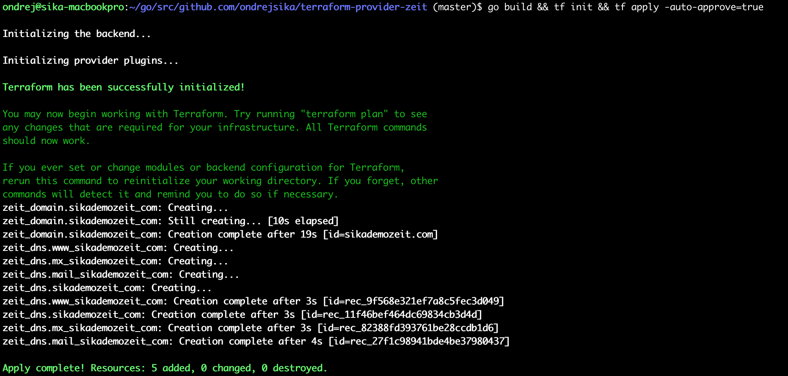

# terraform-provider-zeit

    2019 Ondrej Sika <ondrej@ondrejsika.com>
    https://github.com/ondrejsika/terraform-provider-zeit


## Buy Domain on Zeit.co using Terraform



## Example usage

```terraform
provider "zeit" {
  token = "secret-token"
  // Optional
  // api_origin = "https://zeit-api-mock.sikademo.com"
}

resource "zeit_domain" "sikademozeit_com" {
  domain = "sikademozeit.com"
  expected_price = 12
}

resource "zeit_dns" "sikademozeit_com" {
  domain = "sikademozeit.com"
  name = ""
  value = "1.2.3.4"
  type = "A"
}

resource "zeit_dns" "www_sikademozeit_com" {
  domain = "sikademozeit.com"
  name = "www"
  value = "sikademozeit.com."
  type = "CNAME"
}

resource "zeit_dns" "mail_sikademozeit_com" {
  domain = "sikademozeit.com"
  name = "mail"
  value = "5.6.7.8"
  type = "A"
}

resource "zeit_dns" "mx_sikademozeit_com" {
  domain = "sikademozeit.com"
  name = ""
  value = "99 mail.sikademozeit.com."
  type = "MX"
}

resource "zeit_project" "demo" {
  name = "sika-demo-zeit"
}
```

## Change Log

### v1.2.0

- Add resource `zeit_domain` for buy domains on Zeit

### v1.1.0

- Add `api_origin` configuration for provider

### v1.0.0

- Create provider `zeit`
- Add resource `zeit_dns` with minimum configuration
